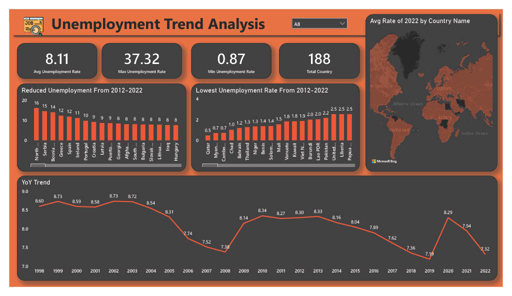
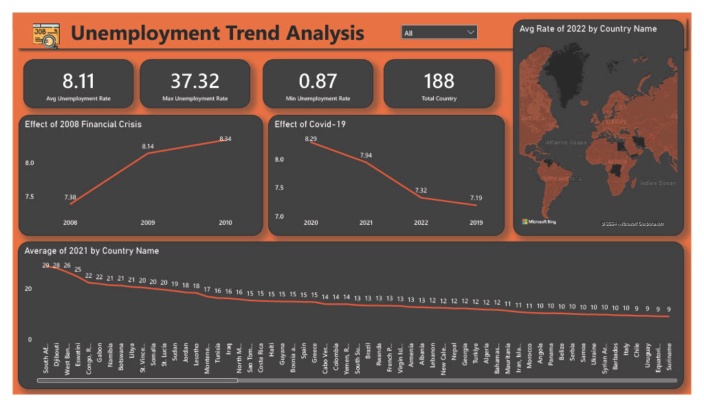

# Unemployment Analysis Project

## Table of Contents

1. [Introduction](#introduction)
2. [Project Overview](#project-overview)
3. [Dataset Description](#dataset-description)
4. [Methodology](#methodology)
5. [Key Questions Addressed](#key-questions-addressed)
6. [Visualizations](#visualizations)
7. [Recommendations](#recommendations)
8. [Conclusion](#conclusion)

## Introduction

This project analyzes global unemployment trends from 1991 to 2022, aiming to uncover insights regarding the factors influencing unemployment rates and the impact of significant economic crises.

## Project Overview

### Objectives

- To examine unemployment trends over three decades.
- To analyze demographic insights and regional differences.
- To assess the impact of the 2008 financial crisis and the COVID-19 pandemic on unemployment rates.

## Dataset Description

The dataset includes unemployment rates for various countries, covering the years 1991 to 2022. Key attributes include:

- **Country:** Name of the country.
- **Year:** Year of the recorded unemployment rate.
- **Unemployment Rate:** Percentage of the labor force that is unemployed.

## Methodology

1. **Data Cleaning:** Checked for missing values and ensured data types were correct.
2. **Descriptive Statistics:** Calculated mean, median, and standard deviation for unemployment rates.
3. **Trend Analysis:** Analyzed changes over time and visualized them with line graphs.
4. **Demographic Insights:** Compared unemployment rates across different demographics and regions.
5. **Crisis Analysis:** Focused on trends during the 2008 financial crisis and the COVID-19 pandemic.

## Key Questions Addressed

1. **Average Global Unemployment Rate (2021):** Calculated the mean unemployment rate for all countries in 2021.
2. **Highest Unemployment Rate (2021):** Identified the country with the highest unemployment rate in 2021.
3. **Global Unemployment Rate Change (1991-2021):** Analyzed the mean for each year and plotted a line graph.
4. **Most Improved Country (2011-2021):** Compared unemployment rates between 2011 and 2021 to find the country with the most improvement.
5. **Impact of the 2008 Financial Crisis:** Analyzed trends from 2008 to 2010.
6. **COVID-19 Impact:** Compared unemployment rates of 2019, 2020, and 2021.
7. **Top 5 Countries with Lowest Average Unemployment (1991-2021):** Ranked countries based on average unemployment rates.
8. **Anomalies in the Dataset:** Identified unusual spikes or drops and researched historical events.
9. **Most Stable Employment Market:** Grouped countries by region and calculated the standard deviation of unemployment rates.
10. **2021 Histogram:** Created a histogram of unemployment rates for 2021.

## Visualizations

- Line graphs showing trends in unemployment rates from 1991 to 2021.
- Bar charts comparing unemployment rates across different demographics.
- A histogram illustrating the distribution of unemployment rates for 2021.

## Recommendations

- Implement targeted training programs to equip job seekers with necessary skills.
- Develop policies aimed at job creation and economic growth.
- Enhance job placement services to assist those affected by unemployment.

## Conclusion

This analysis of global unemployment from 1991 to 2022 has shed light on long-term trends and the effects of major economic crises like the 2008 financial crisis and the COVID-19 pandemic. While global unemployment rates have fluctuated, certain countries have shown resilience and recovery, while others continue to struggle. By analyzing regional trends and uncovering anomalies, this project provides valuable insights into how unemployment can be addressed through targeted policies, economic reform, and support systems aimed at job
